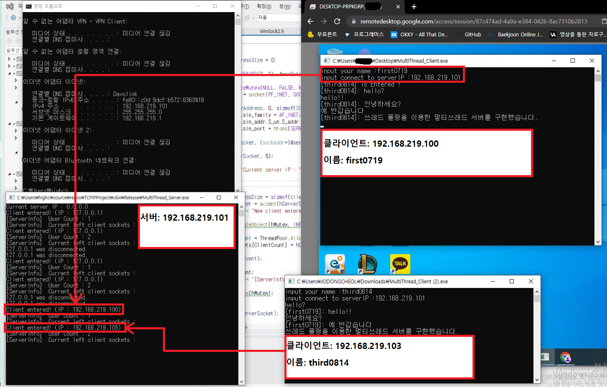

## Introduce 
#### 소개
- '윤성우의 열혈 TCP/IP 소켓 프로그래밍'과 '뇌를 자극하는 윈도우즈 시스템 프로그래밍' 교재를 기반으로 공부하여 구현하였습니다.

## 구현
- [x] 쓰레드 구조체를 별도로 정의
https://github.com/StdDongcheol/SocketProgrammingStudy/blob/a8981ed8bf65efe5f0ea0090f7bb270f1e294559/MultiThread_Server/MultiThread_Server.cpp#L21-L29
 

- [x] 쓰레드풀 구조체 정의 및 초기화 함수
https://github.com/StdDongcheol/SocketProgrammingStudy/blob/a8981ed8bf65efe5f0ea0090f7bb270f1e294559/MultiThread_Server/MultiThread_Server.cpp#L31-L66

- 쓰레드풀은 주로 소켓, 이벤트 오브젝트, 부울 변수를 사용하여 관리된다.   
- 쓰레드풀의 Init함수를 정의하여 파라미터만큼 쓰레드와 이벤트 오브젝트를 생성한다.   
- GetSystemInfo의 NumOfProcessor만큼 쓰레드를 할당할 수 있도록 하였다.   
 

- [x] 대기중인 쓰레드에 소켓 할당
https://github.com/StdDongcheol/SocketProgrammingStudy/blob/a8981ed8bf65efe5f0ea0090f7bb270f1e294559/MultiThread_Server/MultiThread_Server.cpp#L67-L91

- 메인 쓰레드에서 accept 함수로 전달받은 클라이언트 소켓을 쓰레드풀로 전달한다.   
- 쓰레드 풀의 AllocateSocketThread 함수에 소켓을 파라미터로 넘기고 호출한다.   
- 위 함수에서 부울 변수를 확인하여 사용하지않는 쓰레드에 소켓과 SOCKADDR_IN 주소정보를 할당한다.   
- 만약 모든 쓰레드가 이미 할당되어 있다면, NULL을 반환하도록 처리했다.   
 

https://github.com/StdDongcheol/SocketProgrammingStudy/blob/a8981ed8bf65efe5f0ea0090f7bb270f1e294559/MultiThread_Server/MultiThread_Server.cpp#L134-L151
- AllocateSocketThread에서 소켓이 할당된 쓰레드의 이벤트 오브젝트를 반환한다.
- 이벤트 오브젝트의 상태에 따라 SetEvent로 하여 오브젝트를 non-signaled 상태로 전환한다.
- 만약 NULL의 경우, 할당할 수 없는 상태로 판단하여 해당 클라이언트 소켓을 종료하고, 뮤텍스를 반환한다.
 

- [x] 소켓 할당받은 쓰레드를 동작시킬 함수
https://github.com/StdDongcheol/SocketProgrammingStudy/blob/a8981ed8bf65efe5f0ea0090f7bb270f1e294559/MultiThread_Server/MultiThread_Server.cpp#L167-L180
- SetEvent가 실행되는 동시에 쓰레드가 활성화하면서 쓰레드를 지연시킨 WaitForSingleObject부터 수행한다.
- 쓰레드풀을 Init할때, 쓰레드 생성시 인덱스 정보를 파라미터로 넘겼는데, 이는 각 쓰레드가 자신이 몇번 쓰레드인지 구분하는 중요한 역할을 한다. 

https://github.com/StdDongcheol/SocketProgrammingStudy/blob/a8981ed8bf65efe5f0ea0090f7bb270f1e294559/MultiThread_Server/MultiThread_Server.cpp#L181
- recv함수로부터 -1 반환시, 해당 클라이언트의 접속종료 신호로 확인한다.

https://github.com/StdDongcheol/SocketProgrammingStudy/blob/a8981ed8bf65efe5f0ea0090f7bb270f1e294559/MultiThread_Server/MultiThread_Server.cpp#L212-L214
- 메시지 수신 및 송신루프에서 탈출 하자마자 WaitForSingleObject로 뮤텍스를 획득하여
- 임계영역을 설정 후, 쓰레드 정보 초기화 및 소켓 종료를 진행한다. 
 

- [x] 쓰레드 정보 초기화 및 소켓 종료
https://github.com/StdDongcheol/SocketProgrammingStudy/blob/a8981ed8bf65efe5f0ea0090f7bb270f1e294559/MultiThread_Server/MultiThread_Server.cpp#L250-L265
- ResetEvent로 해당 쓰레드 이벤트오브젝트를 non-signaled로 전환하여 다음 WaitForSingleObject에서 SetEvent를 기다리도록 한다.
 

## 결과

 

- 두 개의 클라이언트(192.168.219.100, 192.168.219.103)이 서버(192.168.219.101)로 접속 후 메시지를 서버에게 송신.
- 서버는 클라이언트로부터 받은 메시지를 각 클라이언트에게 송신.
- 클라이언트는 서버로부터 메시지를 수신.
